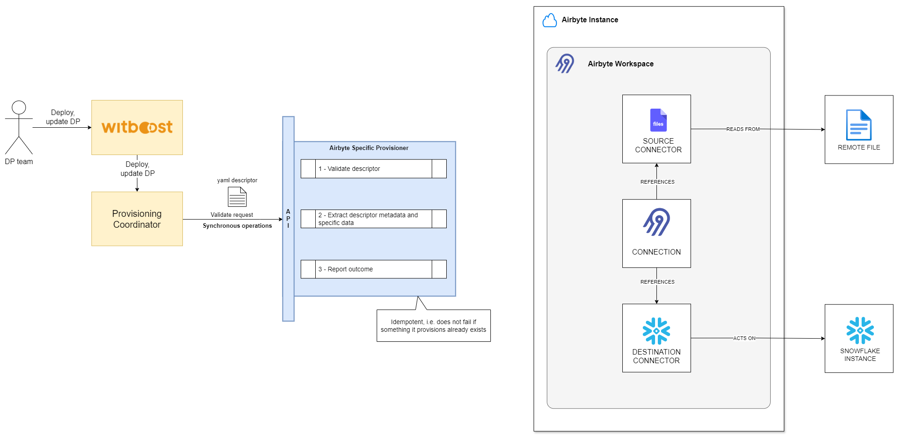
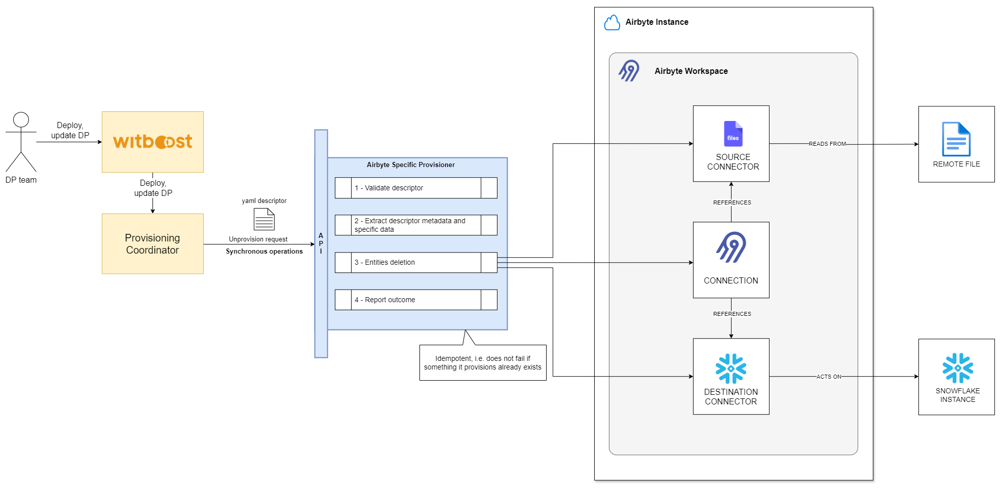

# High Level Design

This document describes the High Level Design of the Azure Synapse Analytics Spark Specific Provisioner.
The source diagrams can be found and edited in the [accompanying draw.io file](hld.drawio).

## Overview

### Specific Provisioner

A Specific Provisioner (SP) is a service in charge of performing a resource allocation task, usually
through a Cloud Provider. The resources to allocate are typically referred to as the _Component_, the
details of which are described in a YAML file, known as _Component Descriptor_.

The SP is invoked by an upstream service of the Witboost platform, namely the Coordinator, which is in charge of orchestrating the creation
of a complex infrastructure by coordinating several SPs in a single workflow. The SP receives
the _Data Product Descriptor_ as input with all the components (because it might need more context) plus the id of the component to provision, named _componentIdToProvision_

To enable the above orchestration a SP exposes an API made up of five main operations:
- validate: checks if the provided component descriptor is valid and reports any errors
- provision: allocates resources based on the previously validated descriptor; clients either receive an immediate response (synchronous) or a token to monitor the provisioning process (asynchronous)
- status: for asynchronous provisioning, provides the current status of a provisioning request using the provided token
- unprovision: destroys the resources previously allocated.
- updateacl: grants access to a specific component/resource to a list of users/groups

### Airbyte

Airbyte is an open-source data integration engine that helps you consolidate your data in your data warehouses, lakes and databases.

Airbyte is conceptually composed of two parts, platform and connectors:
- The platform provides all the horizontal services required to configure and run data movement operations e.g: the UI, configuration API, job scheduling, logging, alerting, etc. and is structured as a set of microservices.
- Connectors are independent modules which push/pull data to/from sources and destinations. Connectors are built in accordance with the Airbyte Specification, which describes the interface with which data can be moved between a source and a destination using Airbyte. Connectors are packaged as Docker images, which allows total flexibility over the technologies used to implement them.

Airbyte enables you to build data pipelines and replicate data from a source to a destination. You can configure how frequently the data is synced, what data is replicated, and how the data is written to in the destination.

#### Source
A source is an API, file, database, or data warehouse that you want to ingest data from.

#### Destination
A destination is a data warehouse, data lake, database, or an analytics tool where you want to load your ingested data.

#### Connector
An Airbyte component which pulls data from a source or pushes data to a destination.

#### Connection
A connection is an automated data pipeline that replicates data from a source to a destination.

#### Workspace
A workspace is a grouping of sources, destinations, connections, and other configurations. It lets you collaborate with team members and share resources across your team under a shared billing account.

### Airbyte Specific Provisioner

This Specific Provisioner interacts with an Airbyte instance using the REST Api interface creating the required entities.

The workload template provides all the information that are needed to create those entities.

Currently, the SP supports:
- [Files](https://docs.airbyte.com/integrations/sources/file) connector as a source with the HTTPS storage provider
- [Snowflake](https://docs.airbyte.com/integrations/destinations/snowflake) connector as a destination

The SP can be extended to support more source and destination connectors.

## Validation

1. **Process Initiation:** The provisioner receives a provisioning request containing a YAML descriptor from the Provisioning Coordinator. This marks the beginning of the validation process.
2. **Descriptor Analysis:** In the initial phase, the descriptor is analyzed for correctness. This includes checking the syntax and the validity of the specific section.
3. **Outcome:** Upon finishing the verification, the provisioner returns a `ValidationResult` and proceeds with the next steps in the execution process. In case of any discrepancies or errors found during the validation process, appropriate error messages are communicated back to the requester.

## Provisioning

1. **Process Initiation:** A provisioning request, containing a YAML descriptor, is sent to the provisioner from the Provisioning Coordinator.
2. **Request Validation:** Upon receiving the request, the provisioner validates it to ensure compliance with required criteria. This validation is crucial for confirming that the processed requests are appropriate and authorized.
3. **Metadata and specific data extraction:** The provisioner extracts all the required metadata and data from the request.
4. **Airbyte entities Creation:** The following entities are created:
   * [Source](#Source)
   * [Destination](#Destination)
   * [Connection](#Connection)
5. **Provisioning Status Feedback:** After the entities creation, the provisioner returns a `ProvisioningStatus`. This status confirms the successful creation of the entities in the system.

## Unprovisioning

1. **Process Initiation:** The provisioner receives a provisioning request containing a YAML descriptor from the Provisioning Coordinator.
2. **Request Validation:** The provisioner validates the request by following the predefined steps. This validation ensures that the request meets the necessary criteria and is authorized for processing.
3. **Metadata and specific data extraction:** The provisioner extracts all the required metadata and data from the request.
4. **Airbyte entities Handling:** The provisioner proceeds to delete all the previously created entities.
5. **Results:** Following the completion of these actions, the provisioner returns a `ProvisioningStatus`. This status serves as confirmation of the request's processing, indicating that the entities have been successfully removed from the system.

